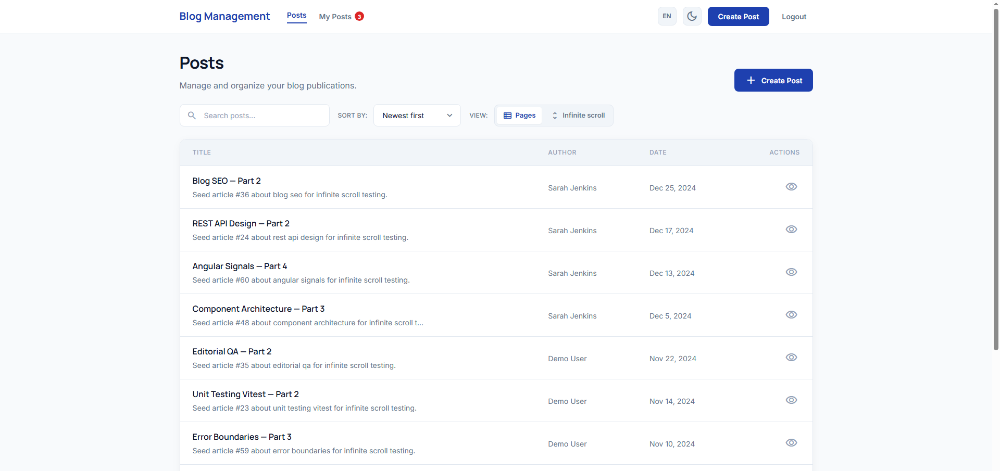
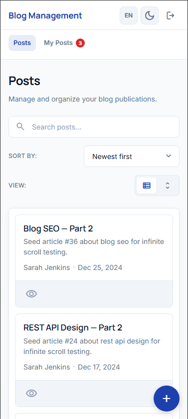
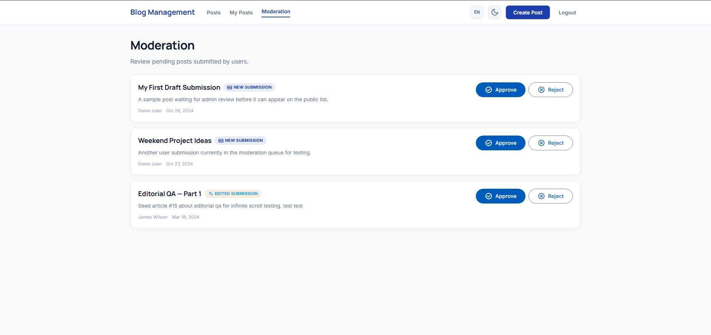
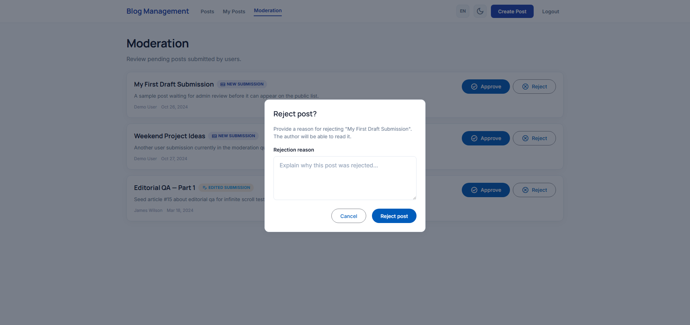
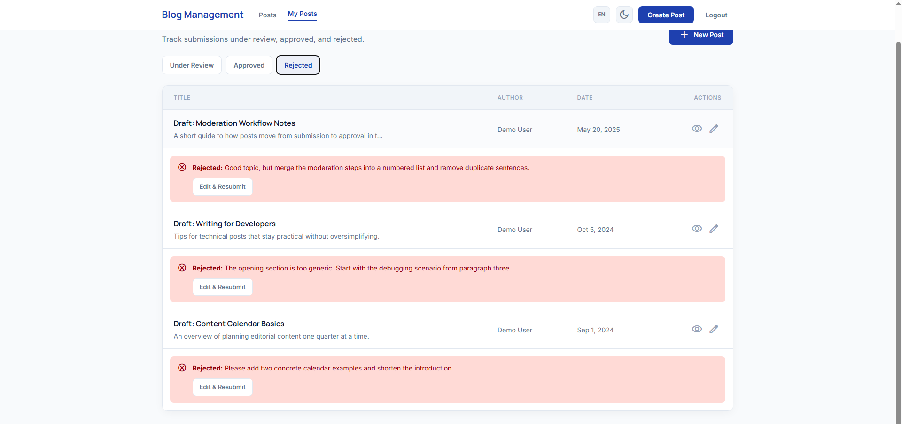
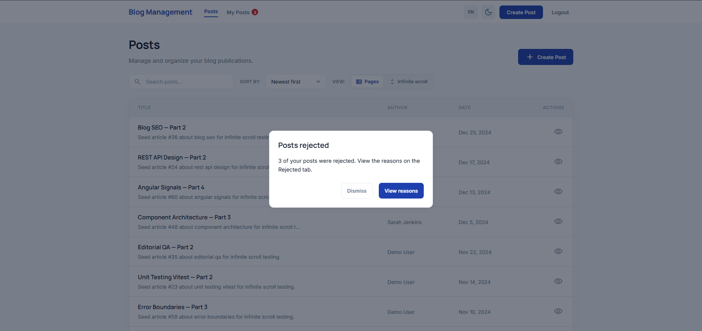
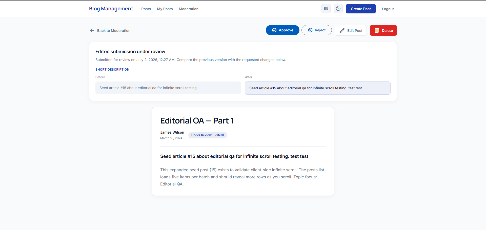

# Blog Management System

Angular SPA for managing blog posts with role-based access, moderation workflow, and full CRUD (list, view, create, edit, delete) plus search, sorting, and pagination.

## Requirements

- Node.js 20+
- npm 11+

## Getting Started

Install dependencies:

```bash
npm install
```

Start the mock API (json-server on port 3000):

```bash
npm run api
```

In a second terminal, start the Angular dev server (proxies `/api` to the mock backend):

```bash
npm start
```

Open [http://localhost:4200](http://localhost:4200). You will be redirected to **Login** — the app requires authentication.

### Demo Accounts

| Email | Password | Role |
|-------|----------|------|
| `admin@blog.com` | `admin123` | Admin — moderate, edit/delete any post, auto-approved creates |
| `user@blog.com` | `user123` | User — submit posts for review, edit/resubmit own posts, delete own posts |

Demo passwords are validated in `AuthApiService` (not stored in `db.json`). json-server exposes `GET /users` without authentication, so storing plaintext passwords in the mock database would leak them to any local consumer; credentials are checked client-side while user identity and role come from the API.

### Other Scripts

```bash
npm run build   # production build
npm test        # unit tests (Vitest, 58 specs)
```

For Lighthouse, serve the production output (not `ng serve`):

```bash
npm run build
npx serve dist/asterbit-task/browser -l 4200
```

## Angular Version

**Angular 22** (standalone components, signals, new control flow)

## Libraries

| Library | Purpose |
|---------|---------|
| **ngx-translate** | UI strings in English and Georgian (`public/i18n/en.json`, `ka.json`); English bundled at build time, Georgian loaded on demand |
| Angular Material | `MatButton`, `MatProgressSpinner` on moderation and initial loading states |
| RxJS | HTTP streams, operators in signal stores |
| json-server | Mock REST API (`db.json`) for posts and users |
| Vitest | Unit testing |

Custom Stitch-styled UI is used for lists, filters, forms, and layout. Shared **`app-modal`** handles logout confirmation, rejection notices, admin reject-with-reason, and delete confirmation flows. Material is used selectively for buttons and spinners.

## Features

### Posts (all logged-in users)

- Browse **approved posts only** on `/posts` (`GET /posts?status=approved`) with debounced title search (`title:contains`), server-side date sort, and server-side pagination or infinite scroll (user preference; `_page` / `_per_page`, total from API `items`)
- Search refetches in the background without unmounting the list — the input keeps focus while a lightweight progress bar indicates filtering
- **Pending** and **rejected** posts are not listed publicly; owners see them under **My Posts**, admins under **Moderation** or via direct URL when permitted
- View post details (owners and admins can open non-approved posts they are allowed to see)
- **Users** submit new posts → `pending` until admin approval
- **Admins** create posts → immediately `approved`
- Create/edit form warns on navigation away with unsaved changes (`postUpsertCanDeactivateGuard` + confirmation modal)
- Header **locale toggle** (EN / KA) and **dark / light theme**
- **Responsive layout** — posts table switches to stacked cards below **850px**; mobile header uses a compact top bar plus scrollable nav links

### My Posts (`/posts/my`)

Tabs for the current user's submissions. Each tab fetches posts filtered by `status` on the server, then filters by `submittedBy` on the client:

- **Under Review** — `pending`
- **Approved**
- **Rejected** — sorted by `rejectedAt` descending (newest rejection first); inline callout shows `rejectionReason` and is part of the same card on narrow screens

Users can edit their own **approved** posts; changes return to `pending` for admin re-review with a before/after diff on post details. **Rejected** posts can be revised and resubmitted for review (`pending`); `rejectionReason` and `rejectedAt` are cleared on submit.

Owners can **delete their own posts** (any status) from post details using the same confirmation modal as admins.

**Rejection notifications** (regular users only):

1. After login, if unseen rejected posts exist → modal on the main layout (page loads first, then overlay)
2. Nav badge on **My Posts** until the user opens the **Rejected** tab
3. Badge on the **Rejected** tab itself while unseen rejections remain
4. Seen / acknowledged state persisted per user in `localStorage`

### Moderation (`/posts/moderation`, admin only)

- Fetches only `pending` posts from the API (`GET /posts?status=pending`)
- Approve or reject from the queue or directly on post details
- **Reject** opens `app-modal` with a required reason (10–500 chars); stores `rejectionReason` and `rejectedAt` on the post
- **New submission** vs **Edited submission** badges on the queue (posts without a reason show **Pending review**)

### Auth

- Mock login via `AuthService` (signals + `localStorage`)
- **Logout** asks for confirmation via `app-modal` before clearing the session
- Route guards: `authGuard`, `adminGuard`, `guestGuard`, `postEditGuard`, `postUpsertCanDeactivateGuard`
- HTTP interceptor attaches a demo bearer token

**Role summary:** admins moderate all posts and can edit/delete any post; users submit posts for review, edit/resubmit own approved or rejected posts, and delete own posts.

## Architecture

Feature-based structure with lazy-loaded routes and signal stores.

```
src/app/
├── core/
│   ├── auth/
│   │   ├── services/      # AuthService, AuthApiService, AuthStorageService
│   │   ├── guards/        # auth, admin, guest
│   │   └── models/        # User, session, roles
│   ├── i18n/              # LocaleService, AppTranslateLoader
│   ├── interceptors/      # authInterceptor, httpErrorInterceptor
│   ├── layout/            # Main shell (responsive header), rejection modal, logout modal
│   ├── config.ts          # API base URL
│   ├── error-handler.ts   # GlobalErrorHandler
│   └── theme/
│       ├── theme.service.ts
│       ├── theme-storage.service.ts
│       └── models/        # app-theme model
├── features/
│   ├── auth/pages/        # Login
│   └── posts/
│       ├── components/    # Table, filters, form, states, revision panel, moderation actions
│       ├── guards/        # postEditGuard, postUpsertCanDeactivateGuard
│       ├── models/        # Post, status, revision, rejection notice, DTOs
│       ├── pipes/         # postStatusLabel
│       ├── services/      # PostsApiService, PostsPermissionService, RejectionNoticeService, …
│       ├── pages/         # List, details, upsert, my-posts, moderation
│       ├── resolvers/     # PostResolver service + route resolver fn
│       ├── store/         # Signal stores per page/flow
│       └── utils/         # Revision diff, rejection notice filters, json-server helpers
└── shared/
    ├── components/        # modal, error-state, empty-state, page-header
    ├── styles/            # _palette, _theme, _reset, _mixins (display-flex, flex-center, …)
    ├── utils/             # body-scroll-lock for modals
    ├── infinite-scroll.directive.ts
    └── truncate.pipe.ts
```

### State Management

Signal stores per feature area (not NgRx):

| Store | Responsibility |
|-------|----------------|
| **PostsListStore** | Fetch approved posts, debounced search, server-side sort, server-side pagination or infinite scroll (`_page` / `_per_page`) |
| **PostDetailsStore** | Resolved post, delete, moderation actions, retry |
| **PostUpsertStore** | Create/update, resolver seed for edit, re-review / rejected resubmit |
| **MyPostsStore** | User's posts per tab (`status` filter on API, owner filter on client, `rejectedAt` sort on Rejected) |
| **ModerationStore** | Pending queue (`status=pending` on API), approve/reject with reason |

RxJS integrates via `switchMap`, `debounceTime`, `distinctUntilChanged`, `catchError`, `tap`, and `finalize`.

### Routing

| Route | Access | Description |
|-------|--------|-------------|
| `/login` | Guest only | Sign in |
| `/posts` | Authenticated | Approved posts only |
| `/posts/my` | Authenticated | Own posts by status tab (`?tab=under-review\|approved\|rejected`) |
| `/posts/moderation` | Admin | Pending review queue |
| `/posts/new` | Authenticated | Create / submit post |
| `/posts/:id` | Authenticated | Post details (+ admin moderation on pending; delete for owner/admin) |
| `/posts/:id/edit` | Admin or post owner (approved or rejected) | Edit form |

- Lazy-loaded standalone routes
- Route resolver preloads post data and enforces view access
- Component input binding for route params, query params, and resolved data

### Mock API

- `npm run api` serves `db.json` at `http://localhost:3000`
- Angular proxy (`proxy.conf.json`) maps `/api/*` → `http://localhost:3000/*`
- Collections: `posts`, `users`
- Post fields include `status`, `submittedBy`, `pendingReason`, `previousVersion` (edited resubmissions), `rejectionReason`, `rejectedAt` (set when admin rejects)
- Post IDs are server-generated strings (json-server v1)
- List queries use json-server v1 syntax (`title:contains=…`, `_sort=-createdAt`, `_page` / `_per_page` for paginated lists)
- Paginated list responses return `{ data, items, pages, … }`; `PostsApiService` maps `data` → posts and `items` → total count
- `PostsApiService` caches list responses per query key and individual posts in an LRU cache (max 100)

Typical list queries:

| Screen | API filter |
|--------|------------|
| `/posts` | `status=approved` (+ optional `title:contains`, `_sort`, `_page`, `_per_page=10`) |
| `/posts/my` → Rejected | `status=rejected&_sort=-rejectedAt`, then client filter by `submittedBy` |
| `/posts/my` → other tabs | `status=pending\|approved`, then client filter by `submittedBy` |
| `/posts/moderation` | `status=pending` |

## Technical Highlights

| Area | Implementation |
|------|----------------|
| **i18n** | `ngx-translate` + `LocaleService`; English bundled via `AppTranslateLoader`, Georgian fetched from `/i18n/ka.json` |
| **Shared modal** | `app-modal` — CSS enter/leave transitions, backdrop/Escape close, projected actions, `body-scroll-lock` on `html` |
| **UI animations** | Native `animate.leave` + CSS transitions (moderation queue); no `@angular/animations` |
| **SCSS** | Shared partials in `shared/styles/` (`_palette`, `_mixins`, …); `display-flex` / `flex-center` mixins via `angular.json` `includePaths` |
| **Unsaved changes** | `postUpsertCanDeactivateGuard` blocks leaving create/edit with dirty form unless confirmed |
| **Performance** | Async Google Fonts + icon subset in `index.html`; SEO meta tags; measure Lighthouse on production build |
| **Rejection notices** | `RejectionNoticeService` + `localStorage` per user (`seen` vs `acknowledged`) |
| **Permissions** | `PostsPermissionService` — view, edit, delete rules for owners and admins |
| **Route Guards** | `authGuard`, `adminGuard`, `guestGuard`, `postEditGuard`, `postUpsertCanDeactivateGuard` |
| **HTTP Interceptor** | `authInterceptor` (bearer token), `httpErrorInterceptor` (401 logout, error logging) |
| **Error handling** | `GlobalErrorHandler` for uncaught client errors |
| **Custom Pipes** | `postStatusLabel`, `truncate` |
| **Custom Directives** | `appInfiniteScroll` (intersection observer) |
| **Unit Tests** | 58 focused tests — guards, stores, services, pipes, theme, revision utils, scroll lock |
| **Responsive UI** | Posts table cards `<850px`; mobile header nav row; FAB for create on small screens |
| **Dark / Light Theme** | `ThemeService` + header toggle, `localStorage` persistence |
| **Local Storage** | Auth session, theme, list view mode, rejection notice state per user |
| **List display** | Server-side pagination (default, 10 per page) or infinite scroll (growing `_per_page`) — persisted in `localStorage` |
| **Authentication** | Mock login with roles (`user` / `admin`) |

### Intentionally not used

| Area | Choice |
|------|--------|
| **NgRx** | Signal stores per feature — simpler for this scope |
| **@angular/animations** | Native CSS `animate.leave` / transitions instead of the deprecated animations package |
| **Firebase** | json-server mock API for local/demo workflow |
| **Backend framework** | json-server stands in for a REST backend |

## Quick Test Flow

### Happy path (approve + re-review)

1. Login as **user** → **Create Post** → **My Posts → Under Review** (post does not appear on main **Posts** list yet)
2. Login as **admin** → **Moderation** → **Approve**
3. Login as **user** → post appears on **Posts** → edit approved post → **Submit for Review**
4. Login as **admin** → open post details → review diff → **Approve**

### Rejection + owner notification

1. Login as **user** → create a post (or use one already under review)
2. Login as **admin** → **Moderation** → **Reject** → enter a reason → confirm
3. Login as **user** → main page loads → rejection modal appears → **View reasons** → **My Posts → Rejected** (newest rejection at top, inline reason callout on the card)
4. Nav / tab badges clear after visiting the **Rejected** tab
5. Click **Edit & Resubmit** → save → post moves to **Under Review** (`rejectionReason` and `rejectedAt` cleared)

### Owner delete

1. Login as **user** → **My Posts** → open own post → **Delete** → confirm in modal
2. Post is removed; you return to the tab you came from

### Logout

1. While logged in, click **Logout** → confirm in modal (or cancel to stay)

### Unsaved form changes

1. Login as **user** → **Create Post** or edit an existing post
2. Change a field, then navigate away (back link, browser back, or another route)
3. Confirmation modal appears — **Stay on page** keeps your edits; **Discard** leaves without saving

## Screenshots

### Posts list

| Desktop | Mobile |
|---------|--------|
|  |  |

### Moderation





### My Posts — Rejected





### Post details — edited submission diff


